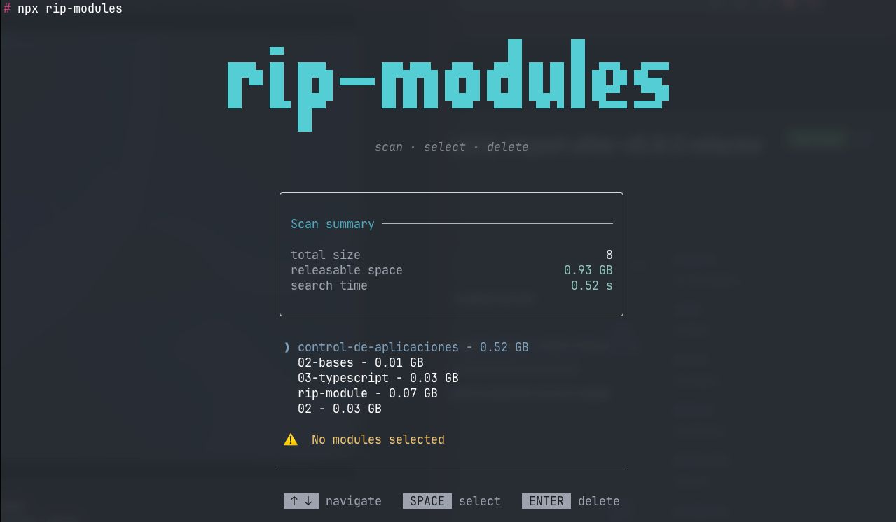

# rip-modules 🗑️

> Scan, select and delete all `node_modules` folders from your projects — fast, visual and interactive.



---

## ✨ Features

- 🔍 **Recursive scan** — finds all `node_modules` folders from any directory
- 📊 **Size display** — shows how much space each folder is using
- ✅ **Multi-select** — choose which ones to delete
- ⚡ **Fast** — built with Bun for maximum speed
- 🎨 **Beautiful UI** — interactive terminal interface powered by Ink

---

## 🚀 Usage

No installation needed. Just run:

```bash
npx rip-modules
```

Or scan a specific directory:

```bash
npx rip-modules /path/to/your/projects
```

---

## 🎮 Controls

| Key | Action |
|-----|--------|
| `↑ ↓` | Navigate between folders |
| `space` | Select / deselect a folder |
| `enter` | Delete selected folders |
| `ctrl+c` | Exit |

---

## 📦 Install globally

If you prefer to install it globally:

```bash
npm install -g rip-modules
rip-modules
```

---

## 🛠️ Development

```bash
# Clone the repo
git clone https://github.com/Uxue404/rip-modules

# Install dependencies
bun install

# Run in dev mode
bun run dev
```

### Scripts

| Command | Description |
|---------|-------------|
| `bun run dev` | Build and run locally |
| `bun run build` | Build for production |
| `bun run clean` | Remove dist folder |

---

## 🏗️ Built with

- [Bun](https://bun.sh/) — JavaScript runtime & bundler
- [Ink](https://github.com/vadimdemedes/ink) — React for CLIs
- [Commander](https://github.com/tj/commander.js) — CLI argument parsing
- [Figlet](https://github.com/patorjk/figlet.js) — ASCII art

---

## 🤝 Contributing

Contributions are welcome! Please open an issue or submit a PR.

1. Fork the repo
2. Create your feature branch (`git checkout -b feat/amazing-feature`)
3. Commit your changes (`git commit -m 'feat: add amazing feature'`)
4. Push to the branch (`git push origin feat/amazing-feature`)
5. Open a Pull Request to `dev` branch

---

## 👤 Author

**Uxue404**
- GitHub: [@Uxue404](https://github.com/Uxue404)

---

## 📄 License

MIT © [Uxue404](https://github.com/Uxue404)